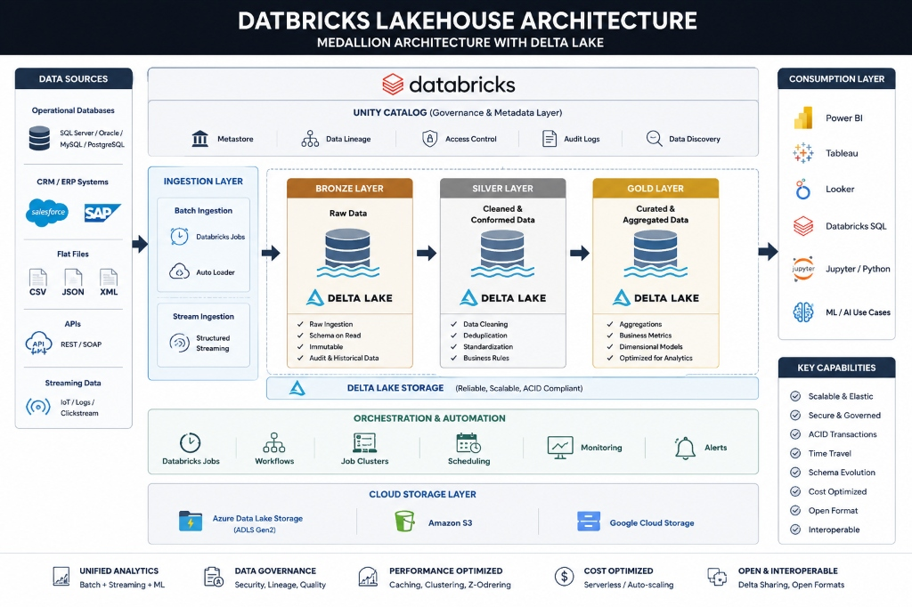

# 🌟 Databricks Lakehouse Medallion Pipeline

[](https://databricks.com/)
[](https://spark.apache.org/)
[](https://delta.io/)
[](https://www.python.org/)

An end-to-end ELT (Extract, Load, Transform) data engineering project built on the **Databricks Lakehouse Platform**. This pipeline ingests transactional and master data from multiple source systems (**CRM** and **ERP**) and processes it through a standard three-layer **Medallion Architecture** (Bronze ➡️ Silver ➡️ Gold) to build a star-schema analytical model using PySpark, SQL, and Delta Lake.

---

## 🏗️ Architecture Overview

The pipeline organizes data into three distinct processing layers to guarantee data quality, lineage, and performance:




1. **Bronze Layer (Raw Ingestion)**: Ingests raw source CSV files directly from Databricks Unity Catalog Volumes into Delta tables in the `bronze` schema without modifying the schema or values.
2. **Silver Layer (Cleanse & Standardize)**: Cleans, filters, casts, and normalizes data. Handles missing values, trims whitespace, standardizes casing, and sets proper data types.
3. **Gold Layer (Analytical Star Schema)**: Enriches and aggregates data to create a reporting-ready dimensional model consisting of Dimension and Fact tables, ready for BI tools like Power BI or Tableau.

---

## 📂 Repository Directory Structure

```directory
.
├── Bronze/
│   ├── Bronze_layer_basic.ipynb      # Step-by-step raw CSV file load to Bronze Delta tables
│   └── Bronze_layer_improved.ipynb   # Configuration-driven dynamic ingestion pipeline
├── Silver/
│   ├── crm/
│   │   ├── silver_crm_cust_info.ipynb      # Cleanses and transforms CRM customer data
│   │   ├── silver_crm_prd_info.ipynb       # Standardizes CRM product master records
│   │   └── silver_crm_sales_details.ipynb  # Processes CRM sales order transactions
│   ├── erp/
│   │   ├── silver_erp_cust_az12.ipynb      # Processes ERP customer master data
│   │   ├── silver_erp_loc_a101.ipynb       # Standardizes customer location records
│   │   └── silver_erp_px_cat_g1v2.ipynb    # Processes product category master lists
│   └── silver_orchestration.ipynb          # Orchestrates all Silver notebook executions
├── Gold/
│   ├── gold_dim_customers.ipynb      # Merges CRM & ERP customers to create dim_customers
│   ├── gold_dim_products.ipynb       # Joins CRM products with ERP categories for dim_products
│   ├── gold_fact_sales.ipynb         # Builds transactional fact table (fact_sales)
│   └── gold_orchestration.ipynb      # Orchestrates all Gold notebook executions
└── README.md                         # Project documentation
```

---

## 🔧 Medallion Layer Pipeline Details

### 🟫 1. Bronze Layer: Ingestion & Raw Staging

The entry point of the pipeline ingests external files from Unity Catalog (UC) Volumes. It acts as an append-only archive preserving the history of raw datasets.

> [!NOTE]
> **Raw Source Data Locations**
> * **📁 CRM System Volume Path:** `/Volumes/workspace/bronze/source_systems/source_crm/`
> * **📁 ERP System Volume Path:** `/Volumes/workspace/bronze/source_systems/source_erp/`

#### 🔄 Ingestion Execution Strategies

| Strategy | Notebook | Mechanism | Key Benefits |
| :--- | :--- | :--- | :--- |
| 📜 **Basic Approach** | 📓 [`Bronze_layer_basic.ipynb`](Bronze/Bronze_layer_basic.ipynb) | 📥 Explicit file-by-file loading via PySpark APIs | 🟢 Easy to debug and troubleshoot<br>🟢 Clean separation of individual scripts |
| ⚡ **Improved (Recommended)** | 📓 [`Bronze_layer_improved.ipynb`](Bronze/Bronze_layer_improved.ipynb) | ⚙️ Configuration-driven dynamic looping using metadata configs | 🚀 Highly scalable and dynamic<br>🛠️ Low maintenance<br>➕ Add new tables via list updates |

*All raw outputs are saved as Delta tables under `workspace.bronze.*` with no transformations applied.*

---

### ⬜ 2. Silver Layer: Cleanse & Standardize

This layer is responsible for data cleaning, type casting, schema reinforcement, and normalizing across CRM and ERP data sources.

#### ⚙️ Data Cleansing Principles
* 🧹 **String Trimming**: Automatic cleanup of leading/trailing whitespace on all string columns.
* 📅 **Date Standardization**: Normalization of varying date patterns (e.g. ERP birthdates) to standard SQL dates.
* 👥 **Null Value Mitigation**: Handling invalid input columns (e.g., mapping gender `'n/a'` values using backup source keys).

#### 📊 Source Transformation Catalog

| Source System | Raw Table (Bronze) | Standardized Table (Silver) | Transformations Applied | Notebook |
| :---: | :--- | :--- | :--- | :--- |
| **🏢 CRM** | 📥 `crm_cust_info` | 🧹 `crm_customers` | ✂️ Trims text fields<br>🚫 Drops duplicate entries<br>🧼 Normalizes values | 📓 [`silver_crm_cust_info.ipynb`](Silver/crm/silver_crm_cust_info.ipynb) |
| **🏢 CRM** | 📥 `crm_prd_info` | 🧹 `crm_products` | 🏷️ Extracts names<br>💳 Casts unit costs to double<br>⏳ Maps active product dates | 📓 [`silver_crm_prd_info.ipynb`](Silver/crm/silver_crm_prd_info.ipynb) |
| **🏢 CRM** | 📥 `crm_sales_details` | 🧹 `crm_sales` | 💵 Type casts currency fields<br>🔢 Validates quantity > 0<br>🧼 Standardizes formats | 📓 [`silver_crm_sales_details.ipynb`](Silver/crm/silver_crm_sales_details.ipynb) |
| **🏭 ERP** | 📥 `erp_cust_az12` | 🧹 `erp_customers` | 📅 Formats birthdates to standard YYYY-MM-DD<br>🆔 Aligns customer codes | 📓 [`silver_erp_cust_az12.ipynb`](Silver/erp/silver_erp_cust_az12.ipynb) |
| **🏭 ERP** | 📥 `erp_loc_a101` | 🧹 `erp_customer_location` | 📍 Standardizes spatial locations<br>🗺️ Normalizes country names | 📓 [`silver_erp_loc_a101.ipynb`](Silver/erp/silver_erp_loc_a101.ipynb) |
| **🏭 ERP** | 📥 `erp_px_cat_g1v2` | 🧹 `erp_product_category` | 🗂️ Standardizes product categories & subcategories | 📓 [`silver_erp_px_cat_g1v2.ipynb`](Silver/erp/silver_erp_px_cat_g1v2.ipynb) |

> [!TIP]
> **Orchestration Tool**: Use [`silver_orchestration.ipynb`](Silver/silver_orchestration.ipynb) to trigger all six notebooks sequentially using `dbutils.notebook.run`.

---

### 🟨 3. Gold Layer: Analytical Star Schema

Transforms standardized Silver tables into a business-level Dimensional Model optimized for analytics, reporting, and BI consumption.

#### 🌟 Star Schema Components

| Table Type | Table Name | Source Input Tables | Modeling Logic & Key Enhancements | Notebook |
| :--- | :--- | :--- | :--- | :--- |
| **💎 Dimension** | 👤 `dim_customers` | 📋 `silver.crm_customers`<br>📍 `silver.erp_customers`<br>🗺️ `silver.erp_customer_location` | 🔗 Joins CRM demographic data with ERP location details.<br>🔑 Generates standard surrogate keys (`customer_key`) using row numbers. | 📓 [`gold_dim_customers.ipynb`](Gold/gold_dim_customers.ipynb) |
| **💎 Dimension** | 📦 `dim_products` | 📋 `silver.crm_products`<br>🗂️ `silver.erp_product_category` | 🔗 Enriches CRM products with ERP categories/subcategories.<br>⏳ Filters out inactive/historical product revisions. | 📓 [`gold_dim_products.ipynb`](Gold/gold_dim_products.ipynb) |
| **📊 Fact** | 💰 `fact_sales` | 📋 `silver.crm_sales`<br>📦 `gold.dim_products`<br>👤 `gold.dim_customers` | 🔗 Joins transaction details with surrogate dimension keys (`customer_key`, `product_key`).<br>📈 Computes business metric metrics (gross sales amount). | 📓 [`gold_fact_sales.ipynb`](Gold/gold_fact_sales.ipynb) |

> [!TIP]
> **Orchestration Tool**: Run [`gold_orchestration.ipynb`](Gold/gold_orchestration.ipynb) to execute the dimension and fact notebooks sequentially in the correct dependency order.


---

## 🚀 Setting Up & Executing the Pipeline

### Prerequisites
1. **Databricks Workspace**: Access to a Databricks environment.
2. **Unity Catalog**: A Unity Catalog enabled metastore with a catalog named `workspace` (or modify catalog references in notebooks as needed).
3. **Database Schemas**: Create schemas for the medallion layers:
   ```sql
   CREATE SCHEMA IF NOT EXISTS workspace.bronze;
   CREATE SCHEMA IF NOT EXISTS workspace.silver;
   CREATE SCHEMA IF NOT EXISTS workspace.gold;
   ```
4. **Unity Catalog Volumes**: Create volumes for raw file staging:
   ```sql
   CREATE VOLUME workspace.bronze.source_systems;
   ```
   *Within the volume, ensure subdirectories `source_crm/` and `source_erp/` contain the raw CSV files (e.g. `cust_info.csv`, `CUST_AZ12.csv`, etc.).*

### Execution Order
Run the layers sequentially or schedule them as a Databricks Job workflow:
1. **Run Ingestion**: Run `Bronze/Bronze_layer_improved.ipynb` to ingest CSV files into Bronze tables.
2. **Orchestrate Silver**: Run `Silver/silver_orchestration.ipynb` to clean and write all Silver tables.
3. **Orchestrate Gold**: Run `Gold/gold_orchestration.ipynb` to construct the Dimensional Model.

---

## 📊 Analytics Schema Representation

The dimensional model generated in the Gold layer is structured for optimized analytical querying:

> ### 👤 Customer Profile Dimension (`dim_customers`)
> *Stores customer demographic records merged from CRM and ERP sources.*
>
> * 🔑 **`customer_key`** &nbsp;•&nbsp; `INT` &nbsp;•&nbsp; **Primary Key**
>   * *Generated during Gold ingestion using a ROW_NUMBER sequence.*
> * 🆔 **`customer_id`** &nbsp;•&nbsp; `VARCHAR(50)` &nbsp;•&nbsp; *Source: CRM*
>   * *Unique alphanumeric customer identifier.*
> * 🔢 **`customer_number`** &nbsp;•&nbsp; `VARCHAR(50)` &nbsp;•&nbsp; *Source: CRM*
>   * *Standardized business identifier for matching across systems.*
> * 👤 **`first_name`** / **`last_name`** &nbsp;•&nbsp; `VARCHAR(100)` &nbsp;•&nbsp; *Source: CRM*
>   * *Cleaned, trimmed, and capitalized names.*
> * 🌍 **`country`** &nbsp;•&nbsp; `VARCHAR(100)` &nbsp;•&nbsp; *Source: ERP*
>   * *Normalized country names mapped from geographic coordinates.*
> * 💍 **`marital_status`** &nbsp;•&nbsp; `VARCHAR(20)` &nbsp;•&nbsp; *Source: CRM*
>   * *Socio-demographic categorization.*
> * 🚻 **`gender`** &nbsp;•&nbsp; `VARCHAR(10)` &nbsp;•&nbsp; *Source: CRM & ERP*
>   * *Standardized gender indicator (imputed from ERP if missing in CRM).*
> * 📅 **`birthdate`** &nbsp;•&nbsp; `DATE` &nbsp;•&nbsp; *Source: ERP*
>   * *Cleaned and formatted date of birth (`YYYY-MM-DD`).*
> * 📅 **`create_date`** &nbsp;•&nbsp; `DATE` &nbsp;•&nbsp; *Source: CRM*
>   * *Timestamp when the customer profile was first generated.*

---

> ### 📦 Product Dimension (`dim_products`)
> *Stores product catalog details enriched with categories and subcategories.*
>
> * 🔑 **`product_key`** &nbsp;•&nbsp; `INT` &nbsp;•&nbsp; **Primary Key**
>   * *Generated during Gold ingestion using a ROW_NUMBER sequence.*
> * 🆔 **`product_id`** &nbsp;•&nbsp; `VARCHAR(50)` &nbsp;•&nbsp; *Source: CRM*
>   * *Unique alphanumeric product identifier.*
> * 🔢 **`product_number`** &nbsp;•&nbsp; `VARCHAR(50)` &nbsp;•&nbsp; *Source: CRM*
>   * *Standardized product serial code.*
> * 📦 **`product_name`** &nbsp;•&nbsp; `VARCHAR(150)` &nbsp;•&nbsp; *Source: CRM*
>   * *Standardized descriptive product name.*
> * 🏷️ **`category_id`** &nbsp;•&nbsp; `VARCHAR(50)` &nbsp;•&nbsp; *Source: CRM*
>   * *Reference ID linking to product category catalog.*
> * 🗂️ **`category`** / **`subcategory`** &nbsp;•&nbsp; `VARCHAR(100)` &nbsp;•&nbsp; *Source: ERP*
>   * *Normalized category classification hierarchy.*
> * 🔧 **`maintenance_flag`** &nbsp;•&nbsp; `VARCHAR(10)` &nbsp;•&nbsp; *Source: ERP*
>   * *Binary flag marking product maintenance requirements.*
> * 📈 **`product_line`** &nbsp;•&nbsp; `VARCHAR(50)` &nbsp;•&nbsp; *Source: CRM*
>   * *Corporate product line categorization.*
> * 📅 **`start_date`** &nbsp;•&nbsp; `DATE` &nbsp;•&nbsp; *Source: CRM*
>   * *Date when the product record was activated.*

---

> ### 📊 Sales Transactions Fact (`fact_sales`)
> *Captures transaction facts joined with customer and product dimension keys.*
>
> * 🧾 **`order_number`** &nbsp;•&nbsp; `VARCHAR(50)` &nbsp;•&nbsp; **Transaction Key**
>   * *Unique identifier for each sales receipt or invoice.*
> * 🔗 **`customer_key`** &nbsp;•&nbsp; `INT` &nbsp;•&nbsp; **Foreign Key**
>   * *Links to customer record in `dim_customers`.*
> * 🔗 **`product_key`** &nbsp;•&nbsp; `INT` &nbsp;•&nbsp; **Foreign Key**
>   * *Links to product record in `dim_products`.*
> * 📅 **`order_date`** &nbsp;•&nbsp; `DATE` &nbsp;•&nbsp; *Source: CRM*
>   * *Date when the order transaction took place.*
> * 📅 **`ship_date`** &nbsp;•&nbsp; `DATE` &nbsp;•&nbsp; *Source: CRM*
>   * *Date the ordered products were dispatched (nullable).*
> * 📅 **`due_date`** &nbsp;•&nbsp; `DATE` &nbsp;•&nbsp; *Source: CRM*
>   * *Payment due date.*
> * 🔢 **`quantity`** &nbsp;•&nbsp; `INT` &nbsp;•&nbsp; *Source: CRM*
>   * *Total number of items purchased in transaction.*
> * 💵 **`price`** &nbsp;•&nbsp; `DECIMAL(18,2)` &nbsp;•&nbsp; *Source: CRM*
>   * *Transactional unit price of the product.*
> * 💰 **`sales_amount`** &nbsp;•&nbsp; `DECIMAL(18,2)` &nbsp;•&nbsp; **Computed Metric**
>   * *Gross sales amount calculated dynamically: `quantity * price`.*


---

## 🛠️ Built With
* [Databricks Workflows](https://docs.databricks.com/workflows/index.html) - Pipeline scheduling & orchestration.
* [Delta Lake](https://delta.io/) - Acid Transactions, Time Travel, Schema Enforcement.
* [Unity Catalog](https://www.databricks.com/product/unity-catalog) - Data governance and volume management.
* [PySpark SQL](https://spark.apache.org/docs/latest/api/python/reference/pyspark.sql/index.html) - Data transformation and processing engine.
